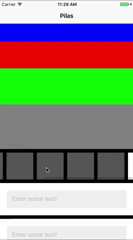

# Pilas

[](https://travis-ci.org/prolificinteractive/Pilas)
[](https://img.shields.io/cocoapods/v/Pilas.svg)
[](http://cocoadocs.org/docsets/Pilas)
[](http://cocoadocs.org/docsets/Pilas)

## Description

A scrollable StackView for quick UI creation.



## Requirements

* iOS 9.0+

## Installation

### CocoaPods
Pilas is available through [CocoaPods](http://cocoapods.org). To install
it, simply add the following line to your Podfile:

```ruby
pod 'Pilas'
```

## Usage

### Initialization

A PilasScrollView can be initialized through a storyboard or programmatically.

```swift
@IBOutlet private weak var stackViewScrollView: PilasScrollView!
```

```swift
var pilasScrollView = PilasScrollView()
```

The axis of the StackView can be changed to change stack and scroll direction. Default is set to vertical.

```swift
horizontalScrollView.axis = .vertical
```
### Inserting Views

Views can be inserted into the PilasScrollView through the `insertView` method. The width and height can also be set to add a width or height constraint depending on the stackView's axis. If the axis is vertical we recommend setting a height constraint and a width constraint for a horizontal axis.

```swift
pilasScrollView.axis = .vertical
pilasScrollView.insertView(view: UIView, height: 50)
```

```swift
pilasScrollView.axis = .horizontal
pilasScrollView.insertView(view: UIView, width: 50)
```

Divider views can also be inserted into the PilasScrollView to allow custom spacing between views. Height and width parameters are available and should be used similarly to inserting views as described above.

```swift
pilasScrollView.axis = .vertical
pilasScrollView.insertDividerView(height: 10, backgroundColor: UIColor.black)
```

### Keyboard Notifications

Keyboard show and hide notifications are enabled by default to increase or decrease the content inset. The default bottom inset can be customized if a project needs a default bottom inset that is not 0.

```swift
pilasScrollView.enableKeyboardNotifications = true
pilasScrollView.defaultBottomInset = 0
```

## Contributing to Pilas

To report a bug or enhancement request, feel free to file an issue under the respective heading.

If you wish to contribute to the project, fork this repo and submit a pull request. Code contributions should follow the standards specified in the [Prolific Swift Style Guide](https://github.com/prolificinteractive/swift-style-guide).

## License


Copyright (c) 2017 Prolific Interactive

Pilas is maintained and sponsored by Prolific Interactive. It may be redistributed under the terms specified in the [LICENSE] file.

[LICENSE]: ./LICENSE
